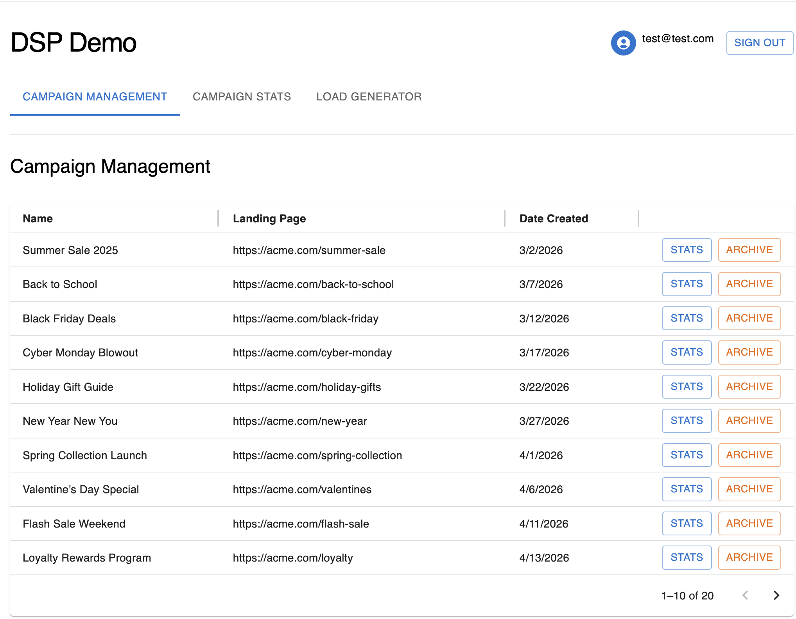
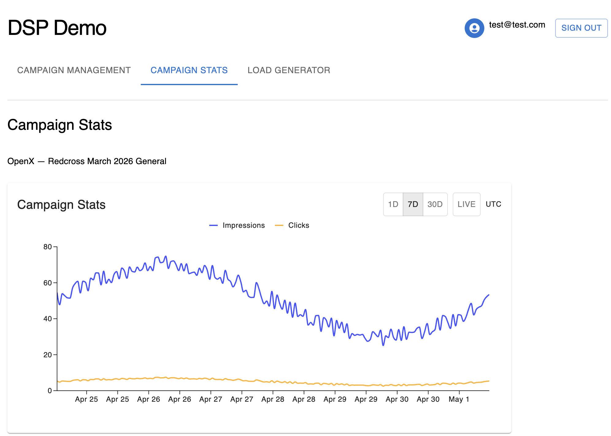
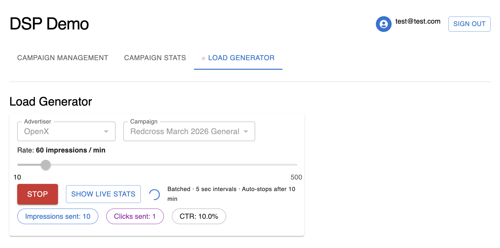
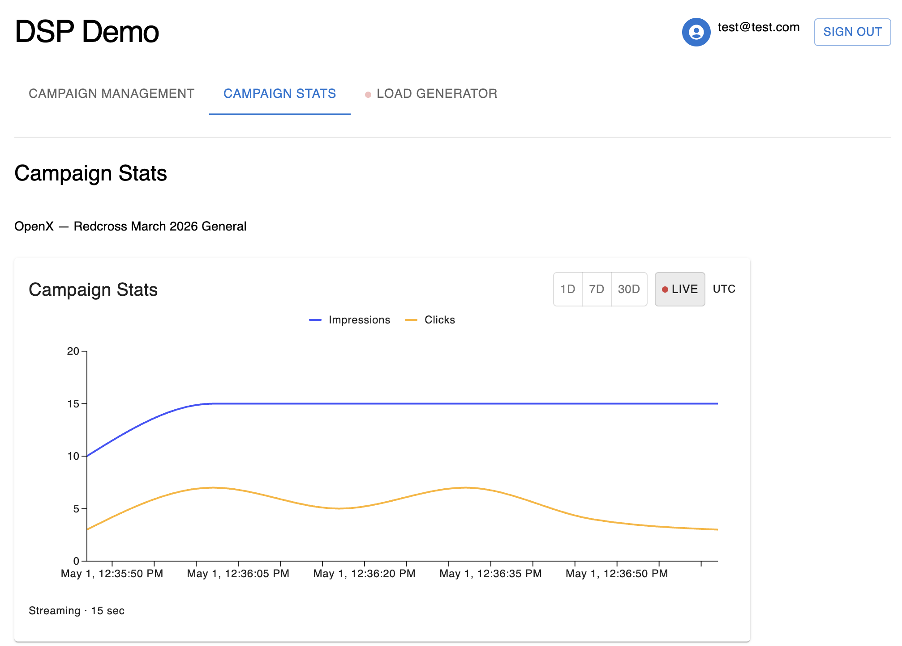

# DSP Demo — AdTech Campaign Analytics Platform

A full-stack demo of a Demand-Side Platform (DSP) with real-time campaign tracking, built with Spring Boot, React, and a hybrid PostgreSQL + DynamoDB persistence layer deployed on AWS.

---

## Tech Stack

| Layer | Technology |
|---|---|
| Frontend | React 19, Vite, MUI, React Router |
| Backend | Spring Boot 4, Spring Security, JPA, SSE |
| Auth | JWT (HMAC-SHA512), AWS Secrets Manager |
| OLTP | PostgreSQL 16 (RDS) |
| High-QPS Ingest | DynamoDB (PAY_PER_REQUEST) |
| Aggregation | Lambda (Node.js 20), DynamoDB Streams, EventBridge |
| Infrastructure | Terraform, ECS Fargate, ALB, CodePipeline, CodeBuild |
| Observability | CloudWatch, Sentry |

---

## System Design

- [ARCHITECTURE.md](docs/architecture/ARCHITECTURE.md) — ALB, Spring Boot endpoints, CRUD, DynamoDB high-QPS ingest, SSE live streaming
- [DATA_INGESTION_ARCHITECTURE.md](docs/architecture/diagrams/DATA_INGESTION_ARCHITECTURE.md) — DynamoDB Streams → Lambda aggregation → S3 → EventBridge → PostgreSQL pipeline

---

## Dashboard

**URL:** http://dsp-demo-ui-production-hosting-316159321784.s3-website-us-east-1.amazonaws.com

> ⚠️ Demo account — no sensitive data.

| Field | Value |
|---|---|
| User | test@test.com |
| Password | DspDemoTest! |

### Screenshots

**Campaign Management**


**Historical Stats**


**Load Generator**


**Live SSE Chart (Real Time data streaming)**


---

## Key API Endpoints

| Method | Path | Description |
|---|---|---|
| `POST` | `/auth/login` | Authenticate, returns JWT |
| `GET` | `/advertisers` | List advertisers |
| `POST` | `/advertisers` | Create advertiser |
| `GET` | `/advertisers/:id/campaigns` | List campaigns |
| `POST` | `/advertisers/:id/campaigns` | Create campaign |
| `GET` | `/advertisers/:id/campaigns/:id/stats` | Historical daily stats |
| `POST` | `/impressions/batch` | Batch ingest impressions → DynamoDB |
| `POST` | `/clicks/batch` | Batch ingest clicks → DynamoDB |
| `GET` | `/advertisers/:id/campaigns/:id/stats/stream` | SSE live stats (15s ticks) |

---

## Local Development

### Prerequisites
- Java 17+
- Docker + Docker Compose
- Node.js 20+
- AWS CLI (configured with credentials for DynamoDB local is optional)

### Backend

```bash
# Start PostgreSQL + DynamoDB Local
docker-compose up -d

# Run Spring Boot
./gradlew bootRun
```

The app starts on `http://localhost:8080`. Dev bypass is enabled — call `GET /auth/dev-login` to get a token without a password.

### Frontend

```bash
cd ../dsp-demo-ui
npm install
npm run dev
```

Opens at `http://localhost:5173`. Dev login runs automatically on localhost.

### Run tests

```bash
# Backend
./gradlew test

# Frontend
cd ../dsp-demo-ui && npm test
```

---

## Infrastructure

Infrastructure is managed with Terraform in the `infra/` directory.

### Required variables

| Variable | Description |
|---|---|
| `github_owner` | GitHub username or organization |
| `github_repo` | Repository name (default: `dsp-demo-project`) |
| `github_branch` | Branch to deploy (default: `main`) |

### Deploy

```bash
cd infra
terraform init
terraform apply -var="github_owner=<your-github-username>"
```

### First deploy notes

1. **GitHub connection** — after `terraform apply`, go to **AWS Console → CodePipeline → Settings → Connections**, select `dsp-demo-production-github`, and click **Update pending connection** to complete the GitHub OAuth flow. The pipeline will not trigger until the connection status is `AVAILABLE`.

2. **Initial ECR push** — the ECS service will fail to start until the ECR repository has an image. Push manually before the pipeline runs:

```bash
aws ecr get-login-password --region us-east-1 | \
  docker login --username AWS --password-stdin <account-id>.dkr.ecr.us-east-1.amazonaws.com

docker build --platform linux/amd64 \
  -t <account-id>.dkr.ecr.us-east-1.amazonaws.com/dsp-demo-production:latest .

docker push <account-id>.dkr.ecr.us-east-1.amazonaws.com/dsp-demo-production:latest
```

### CI/CD pipeline

```
GitHub push → CodePipeline
  └── Source  (CodeStar GitHub connection)
  └── Build   (CodeBuild: ./gradlew bootJar → docker build → ECR push)
  └── Deploy  (ECS rolling update via imagedefinitions.json)
```

---

## Project Structure

```
dsp-demo-project/
├── src/                        # Spring Boot application
│   └── main/java/.../
│       ├── controller/         # REST controllers + SSE
│       ├── service/            # Business logic
│       ├── repository/         # JPA (PostgreSQL) + DynamoDB repositories
│       ├── entity/             # JPA entities + DynamoDB beans
│       ├── auth/               # JWT filter + util
│       └── config/             # Security, DynamoDB, CORS
├── lambda/
│   ├── aggregator/             # DynamoDB Streams → S3 CSV (Node.js)
│   └── loader/                 # S3 → PostgreSQL upsert (Node.js, VPC)
├── infra/                      # Terraform (VPC, ECS, RDS, DynamoDB, CI/CD)
├── docs/
│   ├── architecture/           # System architecture docs + diagrams
│   └── *.png                   # Screenshots
├── buildspec.yml               # CodeBuild build spec
└── docker-compose.yml          # Local dev (PostgreSQL + DynamoDB Local)
```
