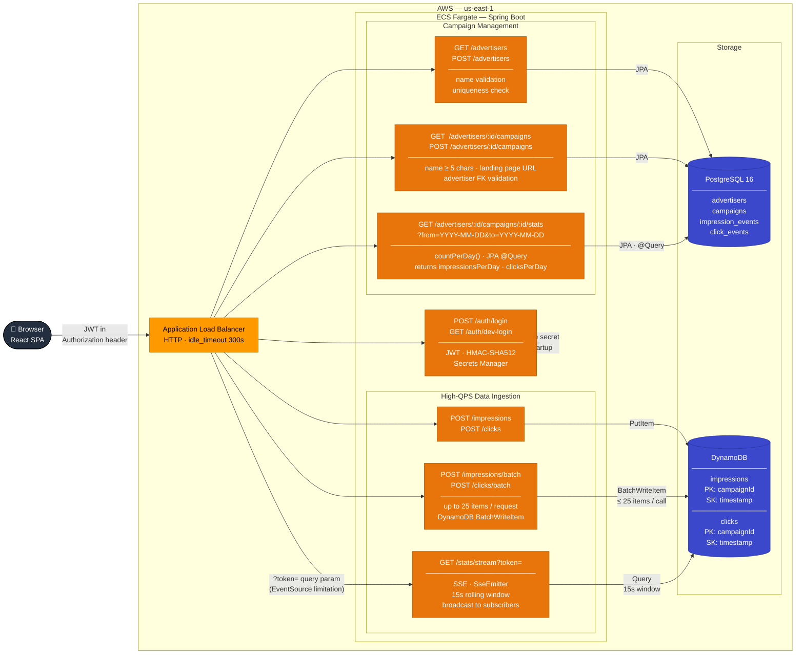

# DSP Demo — System Architecture

## Components

### Application Load Balancer
Single entry point for all traffic. Idle timeout raised to 300 seconds to keep SSE connections alive across the 15-second tick interval. Routes all requests to the single ECS Fargate task.

### Authentication
Stateless JWT issued on login. Every protected endpoint runs through `JwtAuthFilter` which reads the token from the `Authorization: Bearer` header — or from the `?token=` query parameter for SSE connections, since `EventSource` does not support custom headers.

### Campaign Management (CRUD → PostgreSQL)
| Endpoint | Description |
|---|---|
| `GET /advertisers` | List all advertisers |
| `POST /advertisers` | Create advertiser — name validation, uniqueness check |
| `GET /advertisers/:id/campaigns` | List campaigns for an advertiser |
| `POST /advertisers/:id/campaigns` | Create campaign — name ≥ 5 chars, landing page URL, advertiser FK |
| `GET /advertisers/:id/campaigns/:id/stats` | Daily impression + click counts from PostgreSQL aggregates |

All CRUD operations persist to **PostgreSQL** via Spring Data JPA. Stats are read from pre-aggregated `impression_events` and `click_events` tables populated by the ingestion pipeline.

### High-QPS Data Ingestion (→ DynamoDB)
Ad events bypass the relational database entirely and write directly to **DynamoDB** for low-latency, high-throughput ingest.

| Endpoint | Write pattern |
|---|---|
| `POST /impressions` | Single `PutItem` |
| `POST /clicks` | Single `PutItem` |
| `POST /impressions/batch` | `BatchWriteItem` in chunks of 25 (DynamoDB limit) |
| `POST /clicks/batch` | `BatchWriteItem` in chunks of 25 |

Both tables use `campaignId` as the partition key and `timestamp` (ISO-8601) as the sort key. This co-locates all events for a campaign on the same partition and makes range queries — `WHERE timestamp BETWEEN :from AND :to` — efficient without a scan.

### Live Streaming (SSE → DynamoDB)
`GET /stats/stream` opens a persistent SSE connection. A `@Scheduled` task fires every 15 seconds, queries DynamoDB for events in the last 15-second window per active subscriber, and broadcasts a `tick` event with `{ occurredAt, impressions, clicks }`. A keep-alive comment is sent every 20 seconds to prevent the ALB from closing idle connections.

---

> **Data ingestion pipeline** — for a detailed breakdown of how raw DynamoDB events are aggregated by Lambda, written to S3, and loaded into PostgreSQL via EventBridge, see [DATA_INGESTION_ARCHITECTURE.md](diagrams/DATA_INGESTION_ARCHITECTURE.md).
