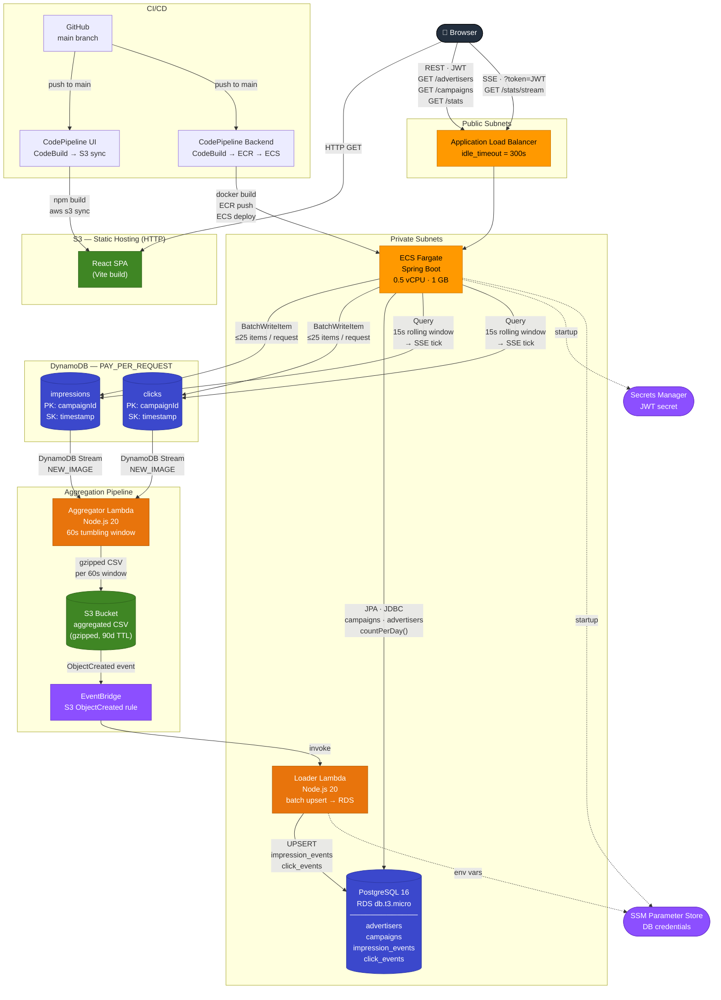

# DSP Demo — Production Architecture

## Data Flow Summary

| Path | Latency | Storage |
|---|---|---|
| Load Generator → Impressions/Clicks | Real-time | DynamoDB (raw events) |
| DynamoDB Stream → Aggregator | ~60s tumbling window | S3 (gzipped CSV) |
| S3 ObjectCreated → Loader → RDS | Seconds after CSV lands | PostgreSQL (daily aggregates) |
| Live chart (SSE) | 15s polling window | DynamoDB (direct query) |
| Historical chart (REST) | On demand | PostgreSQL (countPerDay) |
